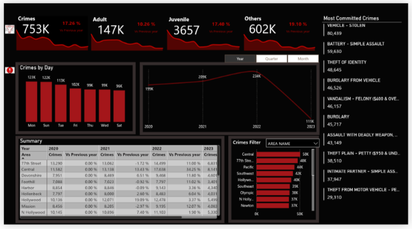
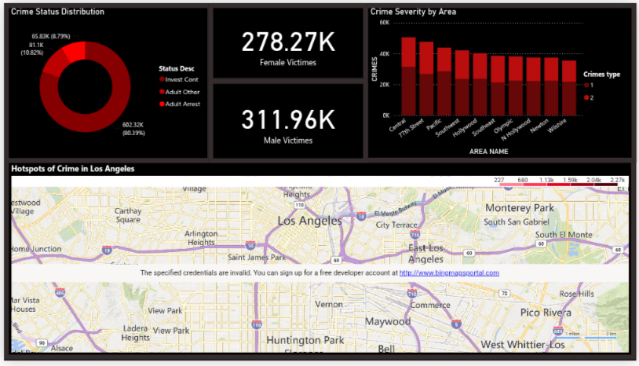

# Los Angeles Crime Analytics Dashboard

## Overview

The Los Angeles Crime Analytics Dashboard is a Power BI project designed to analyze crime patterns, victim demographics, and area-wise crime severity across Los Angeles from 2020 to present. The dashboard provides interactive visualizations and KPI-driven insights that help identify high-crime areas, track yearly trends, and understand victim and offense characteristics using a dataset of 750,000+ crime records.

This project uses Power BI Desktop and Power Query (M) to build an end-to-end analytics solution, from raw data cleaning to interactive dashboard delivery.

---

## Objectives

- Analyze total crime volume and its distribution across adult, juvenile, and other offender categories
- Identify the most frequently committed crime types across Los Angeles
- Track Year-over-Year (YOY) crime trends by year, quarter, and month
- Compare crime counts and growth across LAPD geographic areas
- Analyze victim demographics (gender split) and crime status outcomes (arrest, investigation continued, etc.)
- Visualize crime hotspots geographically across Los Angeles
- Break down crime severity by area for prioritization insights

---

## Tech Stack

- **Power BI Desktop**
- **Power Query (M)**
- **DAX**

---

## Key Features

- KPI cards for total crimes, adult crimes, juvenile crimes, and other categories, each with YoY % change
- Clustered column chart showing crime volume by day of week
- Dynamic line chart with year/quarter/month parameter switching for trend analysis
- Year-wise summary matrix comparing crime counts and % change vs. previous year, broken down by area
- Multi-row card highlighting the top 10 most committed crime types
- Donut chart showing crime status distribution (Adult Arrest, Adult Other, Invest Cont)
- Victim demographic cards (female vs. male victim counts)
- Crime severity bar chart segmented by area and crime type
- Interactive map visualization showing crime hotspots across Los Angeles
- Area-name filter panel for cross-filtering all visuals

---

## Dataset Description

The dataset is sourced from the [Los Angeles Crime Dataset (2020–Present) on Kaggle](https://www.kaggle.com/datasets/nathaniellybrand/los-angeles-crime-dataset-2020-present) and contains 750,000+ individual crime records, including:

- Date of occurrence (year, quarter, month, day)
- Crime type / offense description
- Victim age category (Adult, Juvenile, Other)
- Victim gender
- Area name (LAPD geographic area)
- Crime status (Arrest, Investigation Continued, etc.)
- Crime severity classification

---

## Project Workflow

### 1. Data Cleaning & Transformation

Performed using Power Query Editor:
- Data type correction for date, numeric, and categorical fields
- Handling of blank/null values in victim demographic and status fields
- Standardization of area names and crime descriptions
- Creation of calculated date columns (Year, Quarter, Month) for trend analysis

### 2. Data Modeling

- Built relationships between crime records and area/date dimension tables
- Created DAX measures for YoY comparisons and dynamic parameter-driven trend lines

### 3. Dashboard Development

Created multiple interactive visualizations including:
- KPI Cards
- Clustered Column Chart
- Dynamic Line Chart (parameter-driven)
- Matrix (year-wise, area-wise summary)
- Multi-Row Card
- Donut Chart
- Bar Chart (crime severity by area)
- Filled Map (crime hotspots)

---

## Dashboard Insights

- Total recorded crimes across the dataset reached **753K**, with adult-related crimes at **147K** and juvenile-related crimes at **3,657**
- **Vehicle – Stolen** is the most committed crime type at **80,439** cases, followed by **Battery – Simple Assault** (59,630) and **Theft of Identity** (48,645)
- Crime volume is highest on **Mondays (123K)** and lowest on **Saturdays (96K)**, indicating a mild start-of-week concentration
- Crime counts rose from **199K in 2020 to 234K in 2022**, before the partial 2023 data shows a sharp drop (reflecting incomplete year-to-date records rather than an actual decline)
- **Central**, **77th Street**, and **Pacific** are consistently the highest-crime areas across the year-wise summary and severity breakdown
- Of all recorded outcomes, **80.39%** of cases resulted in **Adult Arrest**, while **10.82%** remain under "Adult Other" status and **8.79%** are still under **investigation**
- Victim gender distribution is relatively balanced, with **311.96K male victims** and **278.27K female victims**
- The hotspot map highlights dense crime clustering around central and south LA districts relative to outer suburban areas

---

## Data Validation

Validation checks were performed for:
- Total crime count reconciliation across KPI cards and the year-wise summary matrix
- Consistency between the "Most Committed Crimes" ranking and area-level severity totals
- Cross-check of victim gender totals against overall crime volume
- Verification of YoY % change calculations in the summary table against raw yearly totals

---

## Project Structure

```
losangelescrime-dashboard/
│
├── README.md
├── Dashboard_Screenshot-1
└── Dashboard_Screenshot-2
```

---

## Dashboard Pages

- Crime Overview Dashboard (KPIs, most committed crimes, day/year trends, area summary)
- Victim & Case Status Analytics (crime status distribution, victim demographics, severity by area)
- Crime Hotspot Map (geographic visualization)

---

## Future Improvements

- Incorporate SQL-based staging for larger-scale, repeatable data refreshes
- Add a predictive model to flag high-risk areas/time periods using Python
- Automate scheduled refresh via Power BI Service and a data gateway
- Add drill-through pages for area-specific deep dives
- Integrate demographic and socioeconomic datasets for deeper contextual analysis

---

## Learning Outcomes

Through this project, the following skills were developed:
- Power Query (M) data cleaning and transformation at scale (750K+ records)
- DAX measure creation for YoY analysis and dynamic parameter-driven visuals
- Dashboard UX design for law-enforcement/public-safety style reporting
- Geographic (map-based) data visualization in Power BI
- Data validation and cross-checking across multiple visual layers

---

## Project Links

- **Kaggle Dataset:** [Los Angeles Crime Dataset (2020–Present)](https://www.kaggle.com/datasets/nathaniellybrand/los-angeles-crime-dataset-2020-present)
- **Dashboard:** [Power BI dashboard](https://github.com/divyeshT007/la-crime-analytics-dashboard/releases/tag/LA_crime)
- **GitHub Repository:** [LA Crime Analytics Dashboard](https://github.com/divyeshT007/la-crime-analytics-dashboard/)
- **LinkedIn Profile:** [Divyesh Timbadiya](https://www.linkedin.com/in/divyesh-timbadiya-546651225)

---

## Preview




---

## Contact

Feel free to connect with me on LinkedIn for any inquiries or collaborations!
